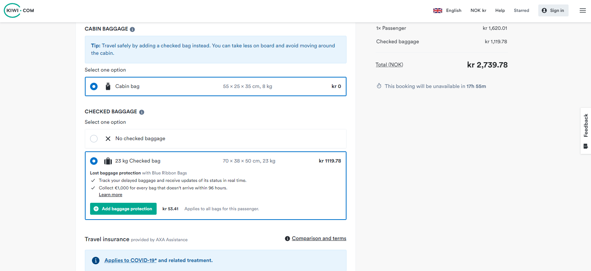
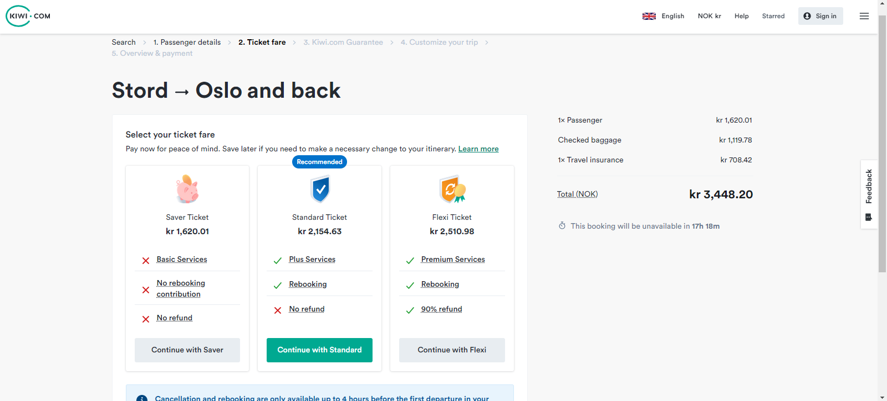

# Complete your booking on kiwi.com

To complete your booking and pay, do the five steps given below:

1. Enter your passenger details
2. Ticket fare
3. Transfer Protection
4. Customize your trip
5. Overview and payment.

## Enter the Passenger details

1) Select **Book**, the *Passenger details* page appears. It also gives the booking summary. The total cost of flight, including taxes, baggage and insurance is shown on the right.

2) Enter the following information in the *Passenger details* page:

    a. Your contact details such a your **Email** and **Phone number**.
    b. Information about the **Primary passenger**, such as:
    
        * Age of the Primary passenger
        * **Given Names** (First Name)
        * **Surnames** (Last Name)
        * **Nationality**
        * **Gender**
        * **Date of Birth** (as DDMMYYYY)
        * **Passport or ID number** (as DDMMYYYY)
        * **Passport or ID expiry date** (as DDMMYYYY, select **No expiry** if your passport or ID has no expiry date)
        

    c.  In **CABIN BAGGAGE**, select **Cabin bag** if you have carry-on baggage. The dimensions of your cabin bag must be within 55 × 25 × 35 cm, and the maximum weight must be 8 kg.
    d. In **CHECKED BAGGAGE**, select **No checked baggage** if you do not have any checked baggage. Select **23 Kg checked bag** to carry checked baggage up to maximum dimensions of 70 × 38 × 50 cm. The maximum allowed weight is 23 kg. Select Add baggage protection to purchase baggage protection insurance.
    
    e. In **Travel insurance**, Select the necessary travel insurance plan. If you do not require travel insurance, select **No insurance**. Select **Comparison and terms** to see a comparison of the given travel plans and the terms and conditions.
    
    e. Select **Add another passenger** to add the other passengers as necessary.
    f. Select **Continue**, the *Select your ticket fare* page opens.

## Select your ticket fare
The *Select your ticket fare* page gives you several fare options such as the **Saver**, **Standard** or **Flexi** ticket. The price of each fare is given.
> **_NOTE:_**  Select **Back** to go back to the previous page and change information you entered there.    
1. Select the required fare by selecting **Continue with Saver**, **Continue with Standard** or **Continue with Flexi**. If you selected the **Saver** or **Standard** fare, you are given the opportunity to upgrade. If you selected **Flexi** fare, the *Kiwi.com Guarantee* page opens.

> **_NOTE:_**  Cancellation and rebooking are only available up to 4 hours before the first departure in your itinerary.

## Select your Kiwi.com Transfer Protection
1. Select the **Kiwi.com Transfer Protection**, or select **No Transfer Protection** to proceed without the *Kiwi.com guarantee*, which gives you a free alternative ticket to your destination, or a full refund in case your trip is affected by carrier delay or cancellation. 

